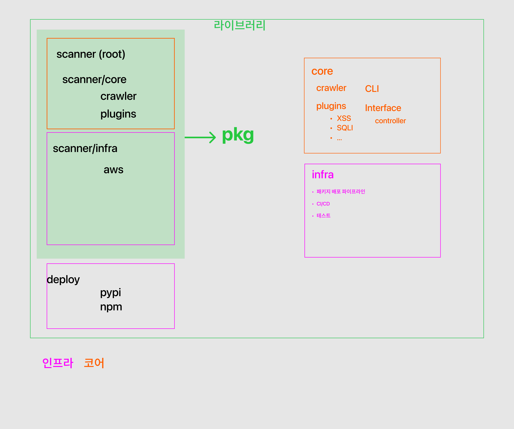

# MVP 계획서 (FIN)

- 25.10.31 작성

---

## 1. 기본 정보 (Project Cover)

### 💠 프로젝트명 & 부제

- 프로젝트명 (초안): 
  — 웹 취약점 스캐너 `PyPi` 라이브러리
  - 부제: 플러그인 기반의 웹 취약점 스캐너 오픈 소스 라이브러리

### 💠 팀명

- **503+1**

### 💠 팀원

- 이택우 (팀장), 이영광, 정완우, 김민지, 정동훈

---

# 2. 프로젝트 개요 (Executive Summary)

**프로젝트의 최종 성과나 해결하고자 하는 문제**

- 웹 애플리케이션에서 흔히 발생하는 취약점(예: XSS, SQL Injection, CSRF, 인증/권한 문제 등)을 자동으로 탐지하고 리포트할 수 있는 **오픈 소스 라이브러리**를 개발·배포한다.  
- 배포는 AWS 기반의 보안·확장·운영성을 고려한 아키텍처로 구성하여, 기업 환경(또는 개발 파이프라인)에서 쉽게 통합·운영할 수 있게 한다.  
    - AWS 아키텍쳐를 코드로 작성하여 환경 자동 구성.
    - 배포 자동화 스크립트 개발
- 목적: 보안검사 자동화로 개발 파이프라인의 취약점 노출을 줄이고, 오픈 소스 커뮤니티에 기여하여 재사용 가능한 툴을 제공.

---

### 💠 목표

Default :

- 오픈 소스 라이브러리 개발 및 파이썬 패키지 배포
  - 파이썬 패키지 `import`하여 코드 레벨에서 실행
  - 명령어 인터페이스로 런타임으로 스캔 실행
- 핵심 웹 취약점 탐지 기능 구현(스캐닝 엔진, 룰셋, 리포팅)  
- 패키지 배포를 위한 `CI/CD` 파이프라인 구축
  - 테스트 코드 통합
- 안전한 스캐닝을 위한 개발 환경 구축
- 문서화(사용자 가이드, 개발자 가이드, 기여 가이드)

Sprint 2 목표:

- AWS 보안 아키텍처 설계 및 배포 자동화 스크립트 개발

---

### 💠 성과 (예상)

- 오픈 소스 라이브러리 레포지토리 (`PyPi`)
- 취약점 스캐너 핵심 모듈(스캔러, 룰 매니저, 리포터)  
  - 모듈 실행 `CLI`
- CI/CD 파이프라인(GitHub Actions / Jenkins) 구축  
- 사용자·운영 문서 및 데모 환경(샘플 애플리케이션 대상 테스트 리포트)
- AWS 기반 배포 템플릿(예: Terraform/CloudFormation, CDK)  

---

# 3. 수행 계획 (Execution Plan)

**세부 수행 절차와 예상 일정(권장)**

### 💠 주요 단계 (Phase별)
#### Sprint 0

1. **준비 및 기획 (25.10.27 ~ 25.10.31)**  
   - 요구사항 수집: 검사 대상(웹 타입, 인증 방식 등), 우선순위 취약점 목록 확정  
   - 범위 정의: 라이브러리 API 형태(라이브러리 사용형 / `CLI` / `REST API`), 오픈 소스 라이선스 결정  
   - 초기 아키텍처 설계

2. **기본 아키텍처 설계 & PoC (25.10.29 ~ 25.10.31)**
    - 기본 개발환경 셋팅
    - 스캐너 엔진 구조 설계
    - 플러그인 기반, 기능 / 컨트롤러 / 크롤러 분리  
    - PoC: 핵심 취약점 2~3종(예: XSS, SQLi)의 검출 흐름 구현
    - 패키지 및 배포 설계

#### Sprint 1

기간: 2025.11.03 ~ 2025.11.14

`MVP` 기능 구현

3. **핵심 기능 개발 (25.10.29 ~ 25.10.31)**  
   - 스캔 엔진 구현(크롤러, 요청 변형 모듈, 룰 매칭)  
   - 룰셋 기본팩 작성(OWASP Top 10 기준 우선 적용)  

4. **인프라 & 배포 자동화**  
   - `CI/CD` 구현(테스트 → 빌드 → 배포)  
   - 리포팅 모듈(HTML/JSON 요약 리포트)

5. **테스트 & QA**  
   - 단위 테스트(개별 모듈 및 함수 레벨 테스트 코드)  
   - 통합 테스트
   - 부하/성능 기초 테스트  
   - 보안 리뷰(권한, 로그 노출 여부 등)

6. **문서화**  
   - 각 팀별 README, Manual 사용법, 기여 가이드
   - 샘플 워크플로우(로컬→AWS 배포 예제)

7. **릴리스 & 데모**  
   - Python Package 공개 릴리스  
   - 데모 세션/발표 자료

> 필요 시 단계별로 병렬 작업(인프라팀 ↔ 백엔드 ↔ 프론트)을 권장합니다.

#### Sprint 2

기간: 2025.11.03 ~ 2025.11.14

8. **추가 기능 개발**  
   - `npm` 패키지 wrapping
   - `scanner/aws`로 `aws` 보안 아키텍처 연동 스크립트 작성

9. **백엔드팀과 협업**  
   - 파이썬 패키지 테스트  
   - 스캐너 사용하여 취약성 검증

---

### 💠 역할 분담 (상세)

- **이택우(팀장)** : 인프라팀 리드, 팀 총괄  
  - 개발 환경 구축
  - CI/CD 구축

- **김민지** : 인프라팀  
  - 개발 환경 구축
  - CI/CD 구축

- **정동훈** : 코어팀 리드
  - 룰셋 구현, 리포터(리포트 포맷/익스포트), 통합 테스트

- **정완우** : 코어팀  
  - 스캔 엔진 핵심 로직(크롤러, 요청 변형, 룰 엔진), API 설계

- **이영광** : 코어팀  
  - 데모 UI/대시보드(스캔 결과 시각화), 사용자 플로우 설계, 피그마 시안

> 모든 팀원은 코드 리뷰, 문서화, 테스트에 기여합니다.

---

### 💠 사용 기술 및 도구

**기술 스택**

- 프로그래밍 언어: **Python**, etc
  - `core`: 스캐너 주요 기능 파이썬으로 개발
  - `infra`: `yml`, `sh` 등 배포 환경 스크립트 작성

**사용 도구**

`MVP` Sprint 1:

- 코드 저장소: GitHub
- CI/CD: GitHub Actions - Jenkins  
- 컨테이너: Docker (이미지 빌드/배포)  
- 이슈/프로젝트 관리: GitHub Issues / Projects, Notion(문서)  
- 디자인: Figma (데모 UI/플로우)

---

Sprint 2 : 

- 로깅/모니터링: CloudWatch / (ELK / OpenSearch — 필요 시)  
- `AWS SIEM` 아키텍처 구성 스크립트 패키지 구성

---

### 💠 유저 플로우 (초안)

  1. 개발자/보안담당자가 스캐너 라이브러리를 로컬/CI 환경에 설치  
  2. 타겟 URL/애플리케이션 정보를 입력(인증 정보는 시크릿으로 등록)  
  3. 스캔 시작 → 크롤러가 엔드포인트 수집 → 공격 벡터(페이로드) 주입 및 응답 분석  
  4. 룰 매칭 후 취약점 발견 시 리포트 생성(심각도, 재현 스텝 포함)  
  5. 결과를 대시보드 또는 CI 리포트로 확인 → 이슈 추적 툴과 연동 가능

---

### 💠 성과물 (최종 산출물)

- 파이썬 패키지 (소스코드, Issue 템플릿, 기여 가이드)  
- 배포 스크립트 / IaC 템플릿  
- 스캐너 핵심 모듈(라이브러리 형태 + 예제 CLI)  
- 샘플 리포트(HTML/JSON) 및 데모 UI  
- 테스트 케이스(샘플 앱 대상) 및 QA 리포트  
- 운영 가이드(Secrets 관리, 권한 정책, 로깅 정책)

---

### 💠 위험요인(리스크) 및 대응 방안

- **리스크:** 취약점 룰의 정확도(오탐/미탐)  
  - **대응:** OWASP Top10 기반 우선 적용, 모듈화된 룰셋, 테스트 케이스로 지속 검증

- **리스크:** AWS 자원 비용 과다  
  - **대응:** 최소 권한/리소스 프로비저닝, 비용 모니터링 알람 설정

- **리스크:** 오픈 소스 라이센스/법적 이슈  
  - **대응:** 라이선스 검토(예: MIT/Apache2 권장), 외부 코드 사용 시 명확한 표기

- **리스크:** 보안 민감 데이터(테스트 중 크리덴셜 노출)  
  - **대응:** 시크릿 암호화/관리, 로그 마스킹 정책

---

### 💠 참고 문헌 및 자료 (추천)

- OWASP Top 10 — 취약점 분류 및 설명 (참고용)  
- OWASP Testing Guide  
- AWS Security Best Practices  
- GitHub OSS 관리 가이드(라이선스·CONTRIBUTING 등)

- [OWASP ZAP](https://github.com/zaproxy/zaproxy)
- [w3af](https://github.com/andresriancho/w3af)
- [nuclei](https://github.com/projectdiscovery/nuclei)
- [보안클라우드 - 정적분석(SAST) vs 동적분석(DAST)](https://boancloud.co.kr/security-issues/4/)
- [tiobe](https://www.tiobe.com/tiobe-index/)
